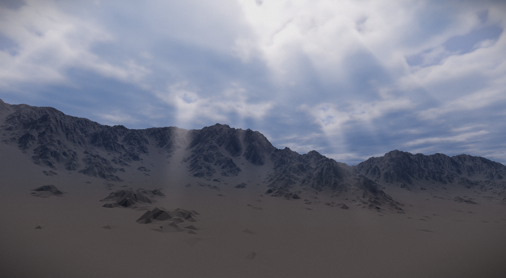

# Atmosphere renderer
This is an implementation of a complete atmospheric model and renderer with support of multiple scattering approximation that gives the sky its specific sky-blue color, sun transmittance, aerial-perspective, soft shadows, dynamic time of day, dynamic volumetric clouds with variable sizes, types and coverage and screen space god rays approximation. All that and more **running under 1.5 ms** on RTX 4080. This code is a part of my masters thesis called 'Realistic atmosphere rendering'.


**Visit [gallery](#gallery) for more images. Visit [performance](#performance) for benchmark results.**

This `README.md` is here to help you to:
- Compile and run the code in this repository
- Understand how to navigate the code
- Understand how to use the atmospheric renderer

Please make sure to follow these steps **exactly** as these were tested to be working on multiple Windows and Linux machines. If there are any issues, feel free to reach out. 

**MacOS unfortunately is not supported.** For macos support (via Molten VK), a window system supporting Metal needs to be added replacing the current one that uses my own header-only [VulkanSurfer](https://github.com/elliahu/VulkanSurfer) library.


# Building
This section should help you build the codebase.

## TL;DR
- `gcc` and `g++` compilers are **required** (may not compile using `msvc` or `clang`).
- CMake with Ninja is recommended for building. 
- Vulkan SDK required as the only dependency. 
- Python required to run shader compilation script.
  
If you are developing on Linux or use Clion and its default configuration on Windows, this should already match. Detailed per OS instructions follow:

## Vulkan SDK required
The atmosphere renderer uses [my own Vulkan engine/wrapper](https://github.com/elliahu/hammock) called **hammock**. That means Vulkan SDK version 1.3.296 or newer is **required**. Recommended version that was used during a benchmark is 1.4.309. You can download Vulkan SDK installer from official [LunarG](https://vulkan.lunarg.com/sdk/home) repository. If you already have Vulkan SDK, the installation will install new version alongside the old version and update the PATH to point to the new version so there should be no problem. You can safely delete the old directory containing the old SDK.

**After the installation, make sure VULKAN_SDK environment variable is present.** It may look like this on Windows: `C:\VulkanSDK\1.4.309.0`. Also, to verify Vulkan SDK installation, you can run `vulkaninfo` command, which will print auto long info about your Vulkan install that at the top of the list contains warnings (if there are any problems) and also the current SDK version that should match the installed version. Then to be sure that you can actually run Vulkan apps, you can run `vkcube` command, which will open a small window with a spinning cube textured as LunarG logo.

### Setup
This is the **required** build environment:
- **Python** (any relevant version) is required as it is used to compile shader using `slangc` compiler that comes with Vulkan SDK. Simple python script has to be run to transpile the shader into SPIR-V format that is used by Vulkan. This is further explained in the Running section.
- **Vulkan SDK** version 1.3.296 or newer as noted above, please read.
- **MinGW-w64** version 11.w64 or newer or any toolset that uses `gcc` and `g++` compilers. You can get it from [MSYS2](https://www.msys2.org/), [Winlibs](https://winlibs.com/) or if on Linux, it should be available in your package manager. On Windows [MSYS2](https://www.msys2.org/) is the easiest and recommended way. You can follow a 7 step tutorial [here](https://code.visualstudio.com/docs/cpp/config-mingw#_installing-the-mingww64-toolchain). On Linux you can use apt, see bellow.
- **CMake** version 3.29 or newer available [here](https://cmake.org/download/) or if on Linux, in your package manager
- **Ninja-build** as a build tool for CMake available [here](https://ninja-build.org/) or if on Linux, in your package manager

On windows: Make sure all these tools are present in your PATH env variable such as like this:
```
C:\msys64\ucrt64\bin
C:\Program Files\CMake\bin
C:\ninja
```
The first one points where the `gcc.exe` and `g++.exe` compilers, second one points to CMake binary `cmake.exe` and last one points where `ninja.exe` is. 

On Linux: you should be able to just install these tools from the apt (or similar) package manager and that is it.
```
sudo apt update
sudo apt install cmake ninja-build build-essential
```

### Windows
Make sure your **cwd** is the root of the project. Then run the following command:
```bash
cmake -S . -B build -G Ninja -DCMAKE_BUILD_TYPE=Release -DCMAKE_C_COMPILER="gcc.exe" -DCMAKE_CXX_COMPILER="g++.exe"
```
You should se output similar to this:
```txt
...
-- Build files have been written to: C:/Users/matej/CLionProjects/atmosphere/build
```
Here it should correctly find the `gcc` and `g++` compilers and Vulkan SDK. 

Then to generate the executable, run this:
```bash
cmake --build build
```
You should see output similar to this:

```txt
... bunch of warnings from the hammock library
[88/88] Linking CXX executable app.exe
```
If you have troubles building, see Troubleshooting section bellow

### Linux
Here the situation is the same except it is easier to install the build tools.
Make sure your **cwd** is the root of the project. Then run the following command:
```bash
cmake -S . -B build -G Ninja -DCMAKE_BUILD_TYPE=Release -DCMAKE_C_COMPILER=gcc -DCMAKE_CXX_COMPILER=g++
```
You should se output similar to this:
```txt
...
-- Build files have been written to: C:/Users/matej/CLionProjects/atmosphere/build
```
Then to generate the executable, run this:
```bash
cmake --build build
```
You should see output similar to this:

```txt
... bunch of warnings from the hammock library
[44/44] Linking CXX executable app
```
If you have troubles building, see Troubleshooting section bellow

## Customized (low-end, high-end) builds
If you are running the code on a low-end hardware (eg. laptop with integrated GPU), you can define a `CLOUD_RENDER_SUBSAMPLE` macro (eg. by uncommenting line in `CMakeLists.txt` at the bottom and rebuilding, or adding `-D CMAKE_CXX_FLAGS="-DCLOUD_RENDER_SUBSAMPLE"` option to the configuration command). This will significantly improve performance by only updating every 16th pixel each frame but it comes at a cost of ghosting clouds.

If you are running the code on a high-end hardware, you can define a `HIGH_QUALITY_CLOUDS` macro (eg. by uncommenting line in `CMakeLists.txt` at the bottom and rebuilding, or adding `-D CMAKE_CXX_FLAGS="-HIGH_QUALITY_CLOUDS"` option to the configuration command). This will render clouds at higher fidelity settings used for captures. The rendering will than become much more GPU power demanding.

Both options adjust cloud rendering as it is the heaviest operation of the whole atmosphere rendering.


# Running
First of all, shaders need to be compiled using the `compile_shaders.py` script. Run the following command:
```bash
python compile_shaders.py
```
This will check that you are on supported OS (Win and Linux) and that your Vulkan installation exists and contains `slangc` compiler. You should see output like this:
```txt
Running doctor ...
Target system Windows detected
Found VULKAN_SDK env var
Found slangc compiler
OK
Creating output dir...
OK
Compiling shaders, this may take few seconds...
OK
```
This needs to be run initially and anytime shaders are changed. So if you make changes to the shaders, you need to rerun the command above. This will generate `spirv` directory containing bunch of `.spv` files.

After shaders are compiled, you can run the built executable like this:

Windows:
```bash
cd build
app.exe --width 1920 --height 1080
```

Linux:
```bash
cd build
./app --width 1920 --height 1080
```

**Required arguments:**
- `--width <value>` horizontal resolution
- `--height <value>` vertical resolution

**Optional arguments:**
- `--weather <stratus|stratocumulus|cumulus|nubis>` selected weather map that is to be loaded. Stratocumulus is default. Note that for some cloud types, absorption value has to be adjusted (eg. stratus naturally has higher absorption than the default value)
- `--terrain <default|mountain>` selected terrain model to be loaded. Default is somewhat flat terrain with small hills. Mountain is model with single giant mountain.
- `--scene <renderer|medium>` selected scene, cane be one of `renderer` for complete atmospheric renderer or `medium` fro the scene with the Stanford dragon from the theoretical section of the thesis


You should see an output that looks like this:
```txt
Device count: 1
physical device: NVIDIA GeForce RTX 2060
Present mode: Mailbox
```
This will differ based on your system but it should display your GPU, and select the best present mode based on your driver and display. If you see that present mode is V-Sync (or V-Sync relaxed), that means a V-Sync was selected as a fallback option and your FPS will be limited to the sync interval of your display, possibly 60hz. If you see any debug messages in the console that starts like `DEBUG: ...` then you are running the app in the debug mode and you need to reconfigure and recompile using the `-DCMAKE_BUILD_TYPE=Release` option.

# Controls
Once the atmosphere renderer is launched, you can play around. 
- **To update values in number inputs, you need to click and drag left or right**. You cannot type values directly. Sorry for that.
- Movement: Using W,A,S,D to fly around, SPACE to fly up and LSHIFT to fly down. You can also adjust precise camera position using the camera options window in `Options -> Camera options`
- What each option in each window does is described in the thesis's appendix

# Project structure
- `assets` contains all the statically loaded assets such as weather maps, noises etc.
- `hammock` contains the Vulkan engine/wrapper used to build the renderer
- `img` contains some screenshots
- `renderer` contains source code of the actual atmosphere renderer
- `medium` contains the Participating medium scene playground scene where you can play around with a participating media rendering parameters. Note this scene is not part of the renderer and as such is not optimized and may not even be stable
- `shaders` contains Slang shaders

If you would like to use different weather map than possible by params, you can change the loaded file in the `renderer/clouds/CloudPass.cpp` file in function `CloudsPass::prepareResources()`:
```cpp
AutoDelete weatherMapData(
    readImage(ASSET_PATH("weather/stratocumulus.png"), w, h, c, Filesystem::ImageFormat::R8G8B8A8_UNORM), [](const void *p) {
            delete[] static_cast<const uchar8_t *>(p);
});
```

# Performance
|                         | RTX 2060 | RTX 3060 | **RTX 4080** |
|-------------------------|----------|----------|-------------|
| Clouds               | 3.421 ms | 3.008 ms | **0.755 ms** |
| Transmittance LUT         | 0.141 ms | 0.127 ms | **0.034 ms** |
| Multiple scattering LUT  | 0.414 ms | 0.371 ms | **0.259 ms** |
| Sky View LUT              | 0.026 ms | 0.024 ms | **0.010 ms** |
| Aerial perspective LUT   | 0.095 ms | 0.097 ms | **0.080 ms** |
| Occlusion mask         | 0.631 ms | 0.615 ms | **0.161 ms** |
| Radial blur         | 0.154 ms | 0.150 ms | **0.040 ms** |
| Sky View LUT up-sample | 0.081 ms | 0.076 ms | **0.020 ms** |
| Composition               | 0.174 ms | 0.128 ms | **0.032 ms** |
| Postprocessing          | 0.069 ms | 0.069 ms | **0.017 ms** |
| **Total frame (with terrain)**       | 6.438 ms | 5.758 ms | **1.773 ms** |

# Gallery




# Troubleshooting
This might help you if something doesn't work

### 'cmake' is not recognized as an internal or external command, operable program or batch file.
This happens if you either did not install cmake correctly or `bin` folder of the cmake installation location is not in your PATH.

### CMake configuration failed
This may happen in this cases
- You did not install  `gcc` and/or `g++` compilers
-  `gcc` and/or `g++` is not in Your PATH

Make sure you correctly installed MinGW-w64 (not clang or msvc (visual studio) or c1, the app is built for MinGW and will probably fail to build using Visual Studio)

### CMake build failed
If the configuration was successful yet the build failed, it may indicate that wrong build tools (Microsoft's msvc from Visual Studio or clang) were used during the build. Delete the build directory, redo the build steps, and make sure you specify `-DCMAKE_C_COMPILER` and `-DCMAKE_CXX_COMPILER` which point to `gcc` and `g++` binaries respectively.

### terminate called after throwing an instance of 'std::runtime_error' what():  failed to open file: ../spv/depth.vert.spv

This means that you did not compile the shaders. Please read the Run section again and compile the shaders. It could also mean your cwd is wrong. Make sure you are launching the app from within the build directory.

### terminate called after throwing an instance of 'std::invalid_argument' what():  Argument value is missing: scene

This means that you did not specify an argument that is required. Please read the Run section again. It could also mean your cwd is wrong. Make sure you are launching the app from within the build directory.

# References
- [The Real-time Volumetric Cloudscapes of Horizon Zero Dawn](https://advances.realtimerendering.com/s2015/The%20Real-time%20Volumetric%20Cloudscapes%20of%20Horizon%20-%20Zero%20Dawn%20-%20ARTR.pdf)
- [Physically Based Sky, Atmosphere and Cloud Rendering in Frostbite](https://media.contentapi.ea.com/content/dam/eacom/frostbite/files/s2016-pbs-frostbite-sky-clouds-new.pdf)
- [Nubis: Authoring Real-Time Volumetric Cloudscapes with the Decima Engine](https://drive.google.com/file/d/0B-D275g6LH7LOE1RcVFERGpkS28/view?resourcekey=0-P04mYcVQ1lDPdn7FDunEIw)
- [A Scalable and Production Ready Sky and Atmosphere Rendering Technique](https://sebh.github.io/publications/egsr2020.pdf)
- [Volumetric Light Scattering as a Post-Process](https://developer.nvidia.com/gpugems/gpugems3/part-ii-light-and-shadows/chapter-13-volumetric-light-scattering-post-process)

